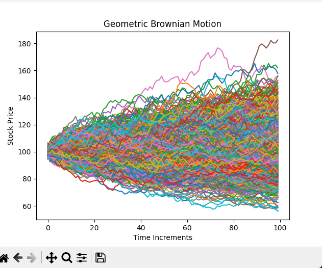

# monte-carlo-options-pricing
quick little experiment testing out options pricing with monte carlo in python

# What is Monte Carlo???
 - a method of determining the probability of an event by simulating a vast number of different scenarios, each with a different set of variables and outcomes
 - this helps price complex derivatives, which is often not possible with traditional methods (black-scholes, binomial tree, etc)

